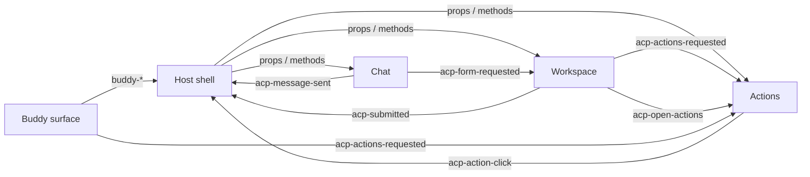

# ACP Chat Panel: Specification

| | |
|---|---|
| **Package** | `@acp/chat-panel` |
| **Spec version** | 0.2.2 |
| **Reference implementation** | Custom Elements bundle (`dist/acp-chat-panel.js`) + CSS (`styles/`) |
| **Status** | Authoritative contract for all implementations |

This document defines the behavior, public API, layout contract, data contracts,
event model, and host integration rules for the ACP Chat Panel system
(Chat + Dynamic Workspace + Actions + optional Buddy enrollment surface).

It is intentionally framework-agnostic. An implementation may be delivered as
Custom Elements, React components, Vue components, or any other UI technology.
The contracts in this document are the authority.

The words **MUST**, **MUST NOT**, **SHOULD**, and **MAY** are used in their usual
normative sense. Notes marked *Reference implementation* describe how the
shipped v0.2.2 bundle behaves and are informative only.

---

## Contents

1. [Purpose & Scope](#1-purpose--scope)
2. [Component Set & Responsibilities](#2-component-set--responsibilities)
3. [Required Shell Layout](#3-required-shell-layout)
4. [Initial & Independent State Rules](#4-initial--independent-state-rules)
5. [Public API](#5-public-api)
6. [Data Contracts](#6-data-contracts)
7. [Event / Callback Contract](#7-event--callback-contract)
8. [Form Trigger Behavior](#8-form-trigger-behavior)
9. [Resizing, Rails, Maximize/Restore](#9-resizing-rails-maximizerestore)
10. [Styling & Theming Contract](#10-styling--theming-contract)
11. [Host Responsibilities & Data Flow](#11-host-responsibilities--data-flow)
12. [Backend & Agentic AI Mapping (recommended)](#12-backend--agentic-ai-mapping-recommended)
13. [Acceptance Checklist](#13-acceptance-checklist)
14. [Appendix: Illustrative Host Patterns](#14-appendix-illustrative-host-patterns)

---

## 1. Purpose & Scope

### 1.1 What this is

The ACP Chat Panel is a **docked, non-overlay AI assistant workspace** that sits
inside a host application's shell, next to its side navigation. It lets a user:

- talk to an AI agent in a full-height chat column,
- work on structured forms the agent opens in an adjacent **Workspace** pane,
- see a running log of completed operations in an **Actions** pane,
- optionally bulk-enter student records in a **Buddy enrollment** workspace,

without leaving or unmounting the page they are on.

### 1.2 What is in the package

| Path | Contents |
|---|---|
| `dist/acp-chat-panel.js` | Reference implementation: four Custom Elements, self-registering on import |
| `dist/acp-chat-panel.d.ts` | TypeScript types for all elements and data contracts |
| `styles/acp-tokens.css` | Design tokens (`--acp-*` CSS variables) |
| `styles/acp-chat-panel.css` | Shell layout classes and component styles |
| `README.md` | Install, quickstart, changelog |
| `AGENT_GUIDE.md` | Step-by-step integration guide for coding agents / developers |
| `SPEC.md` | This document |

### 1.3 Feature list

**Chat**
- Full-height, docked chat column with bottom-anchored composer
- Character counter and configurable max length; Enter to send, Shift+Enter for newline
- Rich message blocks: text, markdown, status, data table, suggestion chips, link, inline form, confirmation, error
- In-conversation search with live result count and clear
- Chat history flyout with one-click conversation restore
- New chat, help, and close controls
- "Thinking..." in-flight indicator and Cancel control
- Agent name tag in header and per-message agent attribution
- Suggestion chips that send a follow-up prompt or request navigation
- `/form` command trigger that opens the Workspace with a generated form

**Workspace (Dynamic Container)**
- Renders a form from a JSON form spec (text, number, date, checkbox, select, textarea)
- Native validation (required, min/max, maxLength) before submit
- Automatic Buddy enrollment surface for `student-enroll` / `buddy-enrol` forms
- Minimize to rail, maximize, restore, close
- Kebab menu with **Open Actions**
- Width, height, and corner resizing (height/corner new in 0.2.2)
- Respects an explicit user close: later agent requests do not force it open

**Actions pane**
- Accumulating activity log with `info` / `success` / `warning` / `error` tints
- Per-item action buttons (e.g. Focus, Copy)
- Activity / Status tabs
- Kebab menu with configurable menu actions (default: **Copy all saved names**)
- Minimize to rail, maximize, restore, close
- Width, height, and corner resizing (height/corner new in 0.2.2)
- Opens automatically beside Workspace when an activity item arrives

**Buddy enrollment workspace (optional)**
- Raw text input with Parse
- Record chip strip with search, pagination, saved and invalid markers
- Editable form for the active record
- Clear, Cancel, Validate, Submit, Submit All
- Posts success items to the Actions pane on submit

**Platform**
- Framework-agnostic (Custom Elements); works with Angular 4–19+, React, Vue, plain HTML
- Theming entirely through CSS variables with opaque surfaces
- Keyboard-operable resize handles, ARIA labels on all controls
- Responsive rules for narrow viewports (≤ 900px)

### 1.4 Out of scope

- Calling an AI model or any backend. The host owns all I/O (see §11, §12).
- Routing. The package *requests* navigation; the host performs it.
- Persisting state (widths, heights, messages, history). The host stores what it needs.
- Rendering the host's sidebar or launch button.

---

## 2. Component Set & Responsibilities

| Component | Reference tag | Responsibility | Owns |
|---|---|---|---|
| **Chat Panel** | `<acp-chat-panel>` | Conversation UI, composer, search, history, suggestion chips, form trigger | Draft text, search term, flyout visibility, its own width |
| **Dynamic Workspace** | `<acp-dynamic-container>` | Displays the active form spec or Buddy surface; emits submissions | Current form spec, in-progress field values, rail/maximize state, width/height |
| **Actions Pane** | `<acp-actions-pane>` | Accumulates activity items; exposes item and menu actions | Item list, active tab, menu state, rail/maximize state, width/height |
| **Buddy Enrollment Workspace** *(optional)* | `<buddy-enrol-workspace-surface>` | Multi-record entry: parse, pick, edit, validate, submit | Records, active record, saved set, search/page |

Components communicate **only through events** (§7). No component calls another
component's methods directly. Workspace and Actions listen for sibling requests
on the nearest `.acp-workspace` ancestor (or `document` if none).



---

## 3. Required Shell Layout

### 3.1 Horizontal order

The host shell **MUST** place the components in this left-to-right order:

```text
+---------+--------------------+--------------------------------------------------+
| sidebar | chat (full height) | stage                                            |
| [AI]    | docked next to     |  +-----------+---------+                         |
| button  | sidebar            |  | Workspace | Actions |  (surface layer, on top) |
|         |                    |  +-----------+---------+                         |
|         |                    |  routed content (stays mounted underneath)       |
+---------+--------------------+--------------------------------------------------+
```

`sidebar | chat | workspace | actions | routed content`

### 3.2 Layout classes (reference CSS)

| Class | Role |
|---|---|
| `.app-shell` / `.app-shell__body` | Optional host wrappers; body is a flex row that fills remaining height |
| `.acp-workspace` | Flex row holding chat + stage. Height is `calc(100vh - --acp-app-header-height)` fallback |
| `.acp-workspace__chat` | Wraps the Chat Panel; full height, fixed-width flex item |
| `.acp-workspace__stage` | Flex item that takes remaining width; `position: relative` |
| `.acp-workspace__content` | Routed content; scrolls independently |
| `.acp-workspace__surface-layer` | Absolutely positioned over the stage; holds Workspace + Actions |
| `.acp-workspace__surface` | Wraps the Workspace |
| `.acp-workspace__actions` | Wraps the Actions pane |

### 3.3 Layout rules

1. Chat **MUST** be docked beside the sidebar, not on the far side of routed content.
2. Chat, Workspace, and Actions **MUST NOT** be modal dialogs, drawers, or floating overlays detached from the shell.
3. Workspace and Actions **MUST** render above routed content without unmounting it.
4. Opening Actions **MUST NOT** replace or close Workspace; they are adjacent columns.
5. Closed components **MUST** occupy zero width. Wrappers **MUST NOT** have a fixed `width`, `min-width`, or `flex-basis`.
6. Minimized components occupy exactly the rail width (`--acp-rail-width`, default 52px).
7. The whole row **MUST** fill the viewport height below the host header; the composer stays pinned to the bottom of Chat.
8. Chat **MUST** live in the app shell, not inside a routed page.

---

## 4. Initial & Independent State Rules

### 4.1 Initial state

| Component | Initial `open` | Initial `minimized` / `maximized` |
|---|---|---|
| Chat | `false` | n/a |
| Workspace | `false` | `false` / `false` |
| Actions | `false` | `false` / `false` |

- Nothing opens on page load. Hosts **MUST NOT** set `open` in initial markup or in a startup hook.
- The host's single AI button in the sidebar is the only thing that opens Chat.

### 4.2 Who opens what

| Trigger | Chat | Workspace | Actions |
|---|---|---|---|
| Host AI button | toggles | no change | no change |
| `acp-form-requested` | no change | opens (unless user closed it, §4.3) | opens if the request carries an `activityItem` |
| `acp-actions-requested` (`open !== false`) | no change | no change | opens, appends item |
| Workspace kebab → **Open Actions** | no change | no change | opens |
| Workspace re-opens (`acp-open-change: true`) | no change | — | re-opens **only** if it already has items |

### 4.3 Independence rules

1. Opening Chat **MUST NOT** open Workspace or Actions.
2. Closing any one component **MUST NOT** close, minimize, or resize another.
3. Actions stays open until the user minimizes or closes it.
4. **Explicit close is sticky for Workspace.** After the user closes Workspace, later `acp-form-requested` events update its form spec but **MUST NOT** re-open it. Setting `open = true` from the host clears this flag.
5. All components stay mounted while closed so they can still receive sibling events.

---

## 5. Public API

Every property below is also available as a kebab-case attribute in the
reference implementation (e.g. `formWidth` ↔ `form-width`). Boolean attributes
are present/absent.

### 5.1 Chat Panel

**Properties**

| Property | Type | Default | Description |
|---|---|---|---|
| `open` | boolean | `false` | Visible when true; zero width when false |
| `title` | string | `"AI Agent"` | Header title |
| `agentDisplay` | string | `""` | Agent name shown next to the title |
| `pending` | boolean | `false` | Shows "Thinking..." pill and Cancel button |
| `placeholder` | string | `"How can I help you today?"` | Composer placeholder |
| `maxLength` | number | `2000` | Composer character limit |
| `width` | number (px) | `380` | Column width, clamped to `[minWidth, maxWidth]` |
| `minWidth` | number (px) | `280` | |
| `maxWidth` | number (px) | `900` | |
| `messages` | `ChatMessage[]` | `[]` | Full message list (host-owned; replace to update) |
| `chatHistory` | `ChatHistoryItem[]` | `[]` | Items for the history flyout |
| `formTriggerPrefix` | string | `"/form"` | Command prefix for §8 |
| `dock` | `'left' \| 'right'` | `'left'` | Reserved. *Reference implementation: not applied to layout.* |

**Methods**

| Method | Effect |
|---|---|
| `startNewChat()` | Clears draft, search, flyouts; emits `acp-new-chat`. Host clears `messages`. |
| `toggleSearch()` | Opens/closes search bar; closing clears the term |
| `clearSearch()` | Clears the search term |
| `toggleHistory()` | Opens/closes the history flyout (closes search) |
| `sendMessage(text)` | Sends `text` as if typed and submitted |

**Header controls:** New chat (+), Search, History, Help (?), Close (×).

**Composer:** Enter sends, Shift+Enter inserts a newline, Send is disabled while
the draft is blank, empty/whitespace messages are never sent. After send the
draft clears. The component does **not** append the user's message to
`messages`; the host does (§11).

**Search:** Case-insensitive match over `text` and each block's `text`,
`markdown`, `message`, `label`, `details`. Shows "N result(s)".

**Empty state:** "I'm ready to help. Tell me what you need, and I'll take it from here."

### 5.2 Dynamic Workspace

**Properties**

| Property | Type | Default | Description |
|---|---|---|---|
| `open` | boolean | `false` | Rendered only when `open` **and** a valid `formSpec` exists |
| `title` | string | `"Dynamic Form"` | Fallback header title (spec title wins) |
| `formSpec` | `FormSpec \| null` | `null` | Normalized on set (§6.3). Resets field values to `initialValues`. |
| `formWidth` | number (px) | `540` | Clamped to `[minFormWidth, maxFormWidth]` |
| `minFormWidth` | number (px) | `320` | |
| `maxFormWidth` | number (px) | `960` | Also the maximized width |
| `formHeight` | number (px) \| `null` | `null` | `null` = full column height. Clamped to `[minFormHeight, viewport bottom − 8]` |
| `minFormHeight` | number (px) | `240` | |
| `minimized` | boolean | `false` | Rail mode |
| `maximized` | boolean | `false` | Expanded to `maxFormWidth` |

**Methods**

| Method | Effect |
|---|---|
| `collapse()` | Minimize to rail |
| `maximize()` | Expand; emits `acp-workspace-maximize` |
| `restore()` | Leave rail/maximize; emits `acp-restore-default-split` |
| `close()` | Close; emits `acp-open-change(false)` and `acp-cancelled` |

**Content:**
- `formId` of `student-enroll` or `buddy-enrol` → embeds the Buddy surface (§5.4).
- Any other spec → generic form: title, optional description, one control per field, **Close** and **Submit** buttons.
- On Submit: browser validation runs first; on success emits `acp-submitted`
  then `acp-actions-requested` with a `success` item "Submitted form successfully."
- Number fields submit `number | null`; checkboxes submit `boolean`; everything else submits `string`.
- *Reference implementation:* an empty element with `data-acp-custom-host="<formId>"` precedes the generic form as a mount point for host-provided content. It is recreated on every render.

**Header controls:** kebab (⋮ → Open Actions), Minimize (−), Maximize/Restore (⤢), Close (×).

### 5.3 Actions Pane

**Properties**

| Property | Type | Default | Description |
|---|---|---|---|
| `open` | boolean | `false` | |
| `title` | string | `"Actions"` | Header title (hosts may label it e.g. "Assembler") |
| `items` | `ActivityItem[]` | `[]` | Activity log (replace to update) |
| `menuActions` | `ActivityAction[]` | `[{ id: 'copy_all_names', label: 'Copy all saved names' }]` | Kebab menu entries |
| `width` | number (px) | `280` | Clamped to `[minWidth, maxWidth]` |
| `minWidth` | number (px) | `220` | |
| `maxWidth` | number (px) | `720` | Also the maximized width |
| `height` | number (px) \| `null` | `null` | `null` = full column height. Clamped to `[minHeight, viewport bottom − 8]` |
| `minHeight` | number (px) | `240` | |
| `minimized` | boolean | `false` | |
| `maximized` | boolean | `false` | |

**Methods:** `collapse()`, `maximize()`, `restore()` (emits `acp-restore-default-split`),
`close()` (emits `acp-open-change(false)` and `acp-actions-close`).

**Behavior:**
- Incoming `acp-actions-requested` items are appended, de-duplicated by `id`.
- Requests the pane dispatched itself are ignored (no self-loop).
- Items render with a left-border tint by `kind`, the item `text`, and one button per `actions[]` entry.
- Empty state: "No actions recorded yet."
- **Copy all saved names**: collects `success` items, strips a leading "Saved " and trailing punctuation, de-duplicates, and writes a comma-separated list to the clipboard.
- *Reference implementation:* the Status tab currently shows the same list as Activity.

**Header controls:** kebab (⋮), Minimize (−), Maximize/Restore (⤢), Close (×).

### 5.4 Buddy Enrollment Workspace (optional)

Rendered automatically by the Workspace for `student-enroll` / `buddy-enrol`
forms, or placed directly by the host.

**Properties**

| Property | Type | Description |
|---|---|---|
| `records` | `BuddyRecord[]` | Records shown in the chip strip |
| `activeRecordId` | string | Record shown in the editable form |
| `buddyText` | string | Raw text in the parser input |
| `parseInFlight` | boolean | Parse button shows "Thinking..." and is disabled |
| `checkInFlight` | boolean | Validate button shows "Validating..." and is disabled |

**Layout (top → bottom):** heading · raw text input + **Parse** · search + record
chips (5 per page, pager) · editable fields (Name, Date of Birth, Gender, Course,
Email, Mobile, Father Name) · **Clear**, **Cancel**, **Validate & check for errors**,
**Submit**, **Submit All**.

**Chip markers:** `✓ Saved` for submitted records, `⚠` for `valid === false`.

**Behavior:**

| Control | Effect | Event(s) |
|---|---|---|
| Parse | Sets `parseInFlight` | `buddy-parse { text }` |
| Chip click | Sets `activeRecordId` | — |
| Search | Filters by name, course, DOB, email, mobile; resets to page 1 | — |
| Field edit | Updates the active record in place | — |
| Clear | Blanks the active record, marks it invalid | `buddy-clear { recordId }` |
| Cancel | Closes the parent Workspace | `buddy-cancel` |
| Validate | Sets `checkInFlight` | `buddy-check { records }` |
| Submit | Marks active saved | `buddy-submit { recordId, record }` + `acp-actions-requested` ("Saved &lt;name&gt;.", Focus) |
| Submit All | Marks all saved | `buddy-submit-all { records }` + `acp-actions-requested` ("Saved all N students.", Copy) |

*Reference implementation notes:*
- Ships with two demo records and demo raw text.
- `parseInFlight` / `checkInFlight` auto-reset after 800 ms.
- `records` and `activeRecordId` are plain fields; the view refreshes on the next user interaction, not on assignment.

---

## 6. Data Contracts

TypeScript notation; implementations in other languages must accept the same JSON.

### 6.1 Chat messages

```ts
type ChatRole = 'user' | 'assistant' | 'system' | 'error';

interface ChatMessage {
  id: string;
  role: ChatRole;             // 'error' renders as assistant
  text?: string;              // used when blocks is empty
  blocks?: ChatBlock[];       // rendered in order; takes precedence over text
  timestamp?: string | Date;  // displayed as given
  agent?: { id?: string; name?: string } | null;  // attribution tag
}

interface ChatHistoryItem {
  id: string;
  title: string;              // "Untitled chat" if blank
  updatedAt: string | Date;
}
```

### 6.2 Message blocks

| `type` | Required fields | Renders as | Interaction |
|---|---|---|---|
| `text` | `text` | Paragraph | — |
| `markdown` | `markdown` (or `text`) | Preformatted text. *Reference: not parsed as Markdown.* | — |
| `status` | `text`, `level?` | Status line; `loading` animates | — |
| `data` | `items: {key, value}[]` | Key/value table | — |
| `suggestions` | `suggestions: Suggestion[]` | Chips with → icon | `acp-suggestion-click`, plus prompt/navigate (§7.1) |
| `link` | `label`, `href` or `route` | Button | `acp-link-click` |
| `form` | `title?`, `fields: FieldSpec[]` | Inline mini-form (text/number inputs) | *Reference: Submit emits no event yet.* |
| `confirmation` | `text` | Text + Confirm / Cancel | `acp-confirmation-action` |
| `error` | `message`, `details?` | Error box | — |
| *(unknown)* | — | Falls back to `text` / `message` | — |

```ts
interface Suggestion {
  id: string;
  label: string;
  action: {
    id: string;
    label: string;
    payload?:
      | { type: 'internal.prompt'; prompt: string }          // sends prompt as a new message
      | { type: 'navigate'; href?: string; route?: string }  // emits acp-navigate
      | Record<string, unknown>;                             // host-defined; host handles via acp-suggestion-click
  };
}
```

All text is HTML-escaped before rendering. Implementations **MUST NOT** render
agent-supplied strings as raw HTML.

### 6.3 Form spec

```ts
type FieldType = 'text' | 'number' | 'date' | 'checkbox' | 'select' | 'textarea';

interface FieldSpec {
  id: string;
  label: string;
  type: FieldType;
  required?: boolean;
  disabled?: boolean;
  placeholder?: string;
  options?: { label: string; value: string }[] | string[];  // select only
  optionsSource?: string;       // opaque hint for the host
  validation?: { min?: number; max?: number; maxLength?: number };
}

interface FormSpec {
  formId: string;
  title: string;
  description?: string;
  submitLabel?: string;         // default "Submit"
  cancelLabel?: string;         // default "Close"
  initialValues?: Record<string, unknown>;
  fields: FieldSpec[];
}
```

**Normalization (MUST be applied on input):**

| Input | Result |
|---|---|
| Unknown field `type` | `text` |
| Field `id` | Kebab-cased; falls back to label, then `field-N` |
| Missing field `label` | Title-cased id |
| `formId` | Kebab-cased; falls back to title, then `dynamic-form` |
| Missing `title` | Title-cased `formId` |
| String options | `{ label: s, value: s }` |
| Options with empty value | Dropped |
| **No valid fields** | **Spec rejected (`null`); Workspace does not open** |

### 6.4 Activity

```ts
interface ActivityAction {
  id: string;
  label: string;
  type?: string;
  payload?: Record<string, unknown>;
}

interface ActivityItem {
  id: string;                   // de-duplication key
  kind: 'info' | 'success' | 'warning' | 'error';
  text: string;
  recordId?: string;            // links back to a Buddy record
  actions?: ActivityAction[];
}
```

Built-in action ids emitted by the package: `focus_record`, `copy_names`
(item actions) and `copy_all_names` (menu). Hosts may define any others.

### 6.5 Buddy record

```ts
interface BuddyRecord {
  id: string;
  name: string;
  dob?: string;                 // ISO date, YYYY-MM-DD
  gender?: string;
  course?: string;
  email?: string;
  mobile?: string;
  fatherName?: string;
  valid?: boolean;              // false shows ⚠
}
```

---

## 7. Event / Callback Contract

In the reference implementation every event is a DOM `CustomEvent` with
`bubbles: true, composed: true`; the payload is in `event.detail`. Other
implementations **MUST** expose an equivalent callback with the same name and
payload (e.g. `onAcpOpenChange(detail)`).

### 7.1 Chat Panel emits

| Event | `detail` | When |
|---|---|---|
| `acp-open-change` | `false` | Close (×) clicked |
| `acp-message-sent` | `string` | User sends a message (trimmed) |
| `acp-form-requested` | `{ formSpec }` | Sent message matches the form trigger (§8) |
| `acp-new-chat` | — | New chat (+) |
| `acp-search-toggle` | `{ open, term }` | Search opened/closed |
| `acp-history-toggle` | `{ open }` | History flyout opened/closed |
| `acp-restore-conversation` | `{ conversationId, item }` | History item clicked |
| `acp-help` | — | Help (?) clicked |
| `acp-cancel-request` | — | Cancel clicked while `pending` |
| `acp-suggestion-click` | `{ suggestion }` | Any suggestion chip clicked (always fires first) |
| `acp-navigate` | `{ href }` | Chip with `payload.type === 'navigate'` |
| `acp-link-click` | `{ href, label }` | Link block clicked |
| `acp-confirmation-action` | `{ confirmed: boolean }` | Confirm / Cancel on a confirmation block |
| `acp-width-change` | `number` | Width changed by drag or keyboard |

A chip with `payload.type === 'internal.prompt'` additionally calls
`sendMessage(prompt)`, which emits `acp-message-sent`.

### 7.2 Workspace emits

| Event | `detail` | When |
|---|---|---|
| `acp-open-change` | `true` / `false` | Opened by a form request / closed |
| `acp-submitted` | `{ formId, values }` | Valid generic form submitted |
| `acp-cancelled` | — | Closed via ×, Close button, or Buddy Cancel |
| `acp-actions-requested` | `{ open: true, item }` | After submit; or forwarded `activityItem` from a form request |
| `acp-open-actions` | — | Kebab → Open Actions |
| `acp-workspace-maximize` | — | Maximized |
| `acp-restore-default-split` | — | Restored from rail or maximize |
| `acp-form-width-change` | `number` | Width changed |
| `acp-form-height-change` | `number` | Height changed *(0.2.2)* |

### 7.3 Actions Pane emits

| Event | `detail` | When |
|---|---|---|
| `acp-open-change` | `true` / `false` | Opened by a request / closed |
| `acp-actions-close` | — | Closed |
| `acp-action-click` | `{ item, actionId }` | Item action button |
| `acp-menu-action-click` | `{ actionId }` | Kebab menu entry |
| `acp-restore-default-split` | — | Restored |
| `acp-actions-width-change` | `number` | Width changed |
| `acp-actions-height-change` | `number` | Height changed *(0.2.2)* |

### 7.4 Buddy surface emits

`buddy-parse { text }`, `buddy-check { records }`, `buddy-clear { recordId }`,
`buddy-cancel`, `buddy-submit { recordId, record }`, `buddy-submit-all { records }`,
plus `acp-actions-requested` on submit (see §5.4).

### 7.5 Events components listen for

| Listener | Event | Reaction |
|---|---|---|
| Workspace | `acp-form-requested` `{ formSpec, activityItem? }` (or a bare spec) | Set spec; open unless explicitly closed; forward `activityItem` as `acp-actions-requested` |
| Actions | `acp-actions-requested` `{ open?, item? }` | Append item; open unless `open === false` |
| Actions | `acp-open-actions` | Open |
| Actions | `acp-open-change` from Workspace with `true` | Re-open if it has items |

Listeners attach to the nearest `.acp-workspace` ancestor, or `document`. The
host **MAY** dispatch any of these events itself to drive the panes.

---

## 8. Form Trigger Behavior

When a sent message starts with the trigger prefix, Chat emits
`acp-form-requested` **in addition to** `acp-message-sent`.

1. Prefixes checked (case-insensitive, longest first): `formTriggerPrefix`, `/forms`, `/form`.
2. An optional `:` after the prefix is ignored. An empty remainder does nothing.
3. The remainder is interpreted:

| Remainder | Resulting form |
|---|---|
| Starts with `{` | Parsed as JSON `FormSpec` and normalized. Invalid JSON or no valid fields → no event. |
| Contains `enroll`, `enrol`, or `student` | Built-in **Student Enrollment Form** (`formId: student-enroll`) → Buddy surface |
| Anything else | Generic form titled from the text, with **Name** (required) and **Details** (textarea) |

Examples:

```text
/form create enroll student form      → Student Enrollment (Buddy)
/form: Leave Request                  → "Leave Request" with Name + Details
/form {"title":"Feedback","fields":[{"label":"Rating","type":"number","validation":{"min":1,"max":5}}]}
```

Built-in Student Enrollment fields: Name*, Date Of Birth*, Gender* (Male/Female/Other),
Course* (Science/Commerce/Arts), Email, Mobile, Father Name (* = required).

The trigger is a convenience for demos and power users. Production agents
**SHOULD** open forms by dispatching `acp-form-requested` with a full spec (§12).

---

## 9. Resizing, Rails, Maximize/Restore

### 9.1 Resizing

| Component | Handle | Axis | Keyboard (focused handle) | Limits | Event |
|---|---|---|---|---|---|
| Chat | Right edge | Width | ← / → ±24px | `minWidth`–`maxWidth` (280–900) | `acp-width-change` |
| Workspace | Right edge | Width | ← / → ±24px | `minFormWidth`–`maxFormWidth` (320–960) | `acp-form-width-change` |
| Workspace | Bottom edge | Height | ↑ / ↓ ±24px | `minFormHeight` (240) – viewport bottom − 8 | `acp-form-height-change` |
| Workspace | Bottom-right corner | Both | — | as above | both events |
| Actions | Right edge | Width | ← / → ±24px | `minWidth`–`maxWidth` (220–720) | `acp-actions-width-change` |
| Actions | Bottom edge | Height | ↑ / ↓ ±24px | `minHeight` (240) – viewport bottom − 8 | `acp-actions-height-change` |
| Actions | Bottom-right corner | Both | — | as above | both events |

Rules:
- Drag uses pointer events on `window`, so it continues outside the handle. Text selection is suppressed and the cursor matches the axis during a drag.
- Sizes are clamped on every update. Events fire only when the clamped value changes.
- A pane with no height set fills the full column. Once resized, it keeps its height until the host sets `formHeight` / `height` back to `null`.
- A height-resized pane's shell wrapper shrinks with it, so routed content shows below.
- Height and corner handles are hidden while a pane is minimized or maximized.
- Each component resizes independently; resizing one never changes another's stored size.

### 9.2 Rails (minimize)

- **−** collapses Workspace or Actions to a vertical rail `--acp-rail-width` (52px) wide showing the pane name vertically and a close (×) button.
- Clicking anywhere on the rail header (except ×) restores the pane.
- The freed width is reclaimed immediately; no empty column remains.

### 9.3 Maximize / Restore

- **⤢** expands the pane to its max width (`maxFormWidth` / `maxWidth`) and the full column height. The adjacent pane stays open.
- **⤢** again (or rail click) restores the stored width and height and emits `acp-restore-default-split`.
- Maximize and minimize are mutually exclusive.

---

## 10. Styling & Theming Contract

### 10.1 Rules

1. All colors, radii, shadows, and shell geometry **MUST** come from `--acp-*` variables.
2. Pane, header, bubble, and input backgrounds **MUST** be opaque. Routed content must never show through a pane.
3. Hosts theme the package by overriding tokens in `:root` (or a scoped ancestor), ideally mapping to their own tokens: `--acp-primary-accent: var(--app-primary, #173b70);`.
4. Hosts **SHOULD NOT** restyle internal classes. If they must, only token-based overrides are supported across versions.

### 10.2 Tokens

| Group | Tokens |
|---|---|
| Surfaces | `--acp-surface-bg`, `--acp-panel-bg`, `--acp-header-bg`, `--acp-stage-bg`, `--acp-bubble-user-bg`, `--acp-bubble-agent-bg`, `--acp-input-bg`, `--acp-rail-bg`, `--acp-rail-hover-bg` |
| Text | `--acp-text-primary`, `--acp-text-secondary`, `--acp-text-muted`, `--acp-text-on-primary`, `--acp-font-family` |
| Borders & radii | `--acp-border-color`, `--acp-border-radius-sm` / `-md` / `-lg` / `-pill` |
| Accent & focus | `--acp-primary-accent`, `--acp-primary-hover`, `--acp-primary-light`, `--acp-focus-ring` |
| Status | `--acp-status-{success,warning,error,info}` and matching `-bg` |
| Elevation | `--acp-shadow-sm` / `-md` / `-lg` |
| Geometry | `--acp-app-header-height` (default `var(--app-header-height, 42px)`), `--acp-pane-header-height` (44px), `--acp-rail-width` (52px) |

### 10.3 Loading styles

Load `acp-tokens.css` **before** `acp-chat-panel.css`, then host overrides.

```css
/* Modern bundlers */
@import '@acp/chat-panel/tokens.css';
@import '@acp/chat-panel/styles.css';

/* Webpack 4 / older Angular CLI */
@import '~@acp/chat-panel/styles/acp-tokens.css';
@import '~@acp/chat-panel/styles/acp-chat-panel.css';
```

### 10.4 Responsive

At ≤ 900px viewport width the surface layer spans the stage and scrolls
horizontally; Workspace defaults to `min(520px, 85vw)` and Actions to
`min(280px, 75vw)`.

---

## 11. Host Responsibilities & Data Flow

### 11.1 The host MUST

1. Render the shell layout (§3) and load the styles (§10).
2. Provide exactly **one** AI toggle button, at the bottom of its existing sidebar. Create a sidebar only if none exists. Never put the button in a top bar.
3. Keep the `open` state of each component and sync it from `acp-open-change`.
4. Own the message list: on `acp-message-sent`, append the user message, set `pending = true`, call the backend, append the reply, set `pending = false`.
5. Handle `acp-cancel-request` by aborting the in-flight call and clearing `pending`.
6. Perform navigation for `acp-navigate` / `acp-link-click`.
7. Persist submissions from `acp-submitted` and `buddy-*` events.
8. Store sizes from `*-width-change` / `*-height-change` if they should survive reloads.
9. Keep all components mounted; control visibility only through `open`.

### 11.2 The host MUST NOT

- Open any component on page load.
- Open Workspace or Actions as a side effect of opening Chat.
- Wrap components in modals, drawers, or overlays.
- Render agent-supplied HTML inside the components.

### 11.3 Typical turn

```mermaid
sequenceDiagram
  actor U as User
  participant C as Chat
  participant H as Host
  participant B as Backend / Agent
  participant W as Workspace
  participant A as Actions

  U->>C: types "enroll these students", Enter
  C->>H: acp-message-sent("enroll these students")
  H->>C: messages += user msg; pending = true
  H->>B: POST /chat { conversationId, text, context }
  B-->>H: { message, formSpec?, activityItem? }
  H->>C: messages += reply; pending = false
  H->>W: dispatch acp-form-requested { formSpec }
  W-->>H: acp-open-change(true)
  U->>W: fills form, Submit
  W->>H: acp-submitted { formId, values }
  W->>A: acp-actions-requested { item: success }
  H->>B: POST /forms/{formId} values
```

---

## 12. Backend & Agentic AI Mapping (recommended)

The package is transport-agnostic. This mapping is recommended so any agent
backend can drive the UI with plain JSON.

### 12.1 Agent response envelope

```ts
interface AgentTurnResponse {
  message: ChatMessage;                 // role 'assistant', blocks preferred
  formSpec?: FormSpec;                  // → dispatch acp-form-requested
  activityItems?: ActivityItem[];       // → dispatch acp-actions-requested per item
  navigate?: { href: string };          // → host router (optional, prefer suggestion chips)
  conversationId: string;
}
```

### 12.2 Mapping table

| Agent concept | UI contract |
|---|---|
| Plain answer | `ChatMessage` with `text` or a `text` block |
| Tool call in progress | `pending = true`, or a `status` block with `level: 'loading'` |
| Tool result / record summary | `data` block |
| Follow-up options | `suggestions` block with `internal.prompt` payloads |
| Deep link into the app | `suggestions` with `navigate` payload, or a `link` block |
| Needs structured input | `formSpec` → Workspace |
| Needs a yes/no before acting | `confirmation` block → `acp-confirmation-action` |
| Committed side effect | `ActivityItem` (`success`) → Actions |
| Partial failure | `ActivityItem` (`warning`/`error`) and/or `error` block |
| Bulk record extraction | Buddy: `buddy-parse` → backend → set `records` |
| Record validation | Buddy: `buddy-check` → backend → set `valid` on records |
| Conversation list | `chatHistory` from a history endpoint; restore on `acp-restore-conversation` |
| User abort | `acp-cancel-request` → abort request / cancel agent run |

### 12.3 Recommended endpoints

| Method | Path | Triggered by |
|---|---|---|
| `POST` | `/agent/turn` | `acp-message-sent` |
| `POST` | `/agent/turn/{id}/cancel` | `acp-cancel-request` |
| `GET` | `/agent/conversations` | Opening Chat / `acp-history-toggle` |
| `GET` | `/agent/conversations/{id}` | `acp-restore-conversation` |
| `POST` | `/forms/{formId}` | `acp-submitted` |
| `POST` | `/enrol/parse` | `buddy-parse` |
| `POST` | `/enrol/validate` | `buddy-check` |
| `POST` | `/enrol/records` | `buddy-submit`, `buddy-submit-all` |

### 12.4 Agent guidance

- Send **context** with each turn: current route, whether Workspace is open, active `formId`, active Buddy record id. This lets the agent refine an open form instead of opening a new one.
- Validate all agent output against §6 before handing it to the UI. Drop specs that normalize to `null`.
- Treat every agent string as untrusted text. Never inject it as HTML.
- Keep side effects behind a `confirmation` block or an explicit form Submit.

---

## 13. Acceptance Checklist

**Layout**
- [ ] Order is `sidebar | chat | workspace | actions | routed content`.
- [ ] Chat fills full height; composer pinned to bottom at any message count.
- [ ] Workspace and Actions render above routed content without unmounting it.
- [ ] Closed components leave no residual column.

**Initial & independent state**
- [ ] On load, Chat, Workspace, and Actions are all closed.
- [ ] Exactly one AI button, at the bottom of the host sidebar; it toggles Chat.
- [ ] Opening Chat opens nothing else.
- [ ] Closing any component leaves the others unchanged.
- [ ] After the user closes Workspace, a new form request does not re-open it.

**Chat**
- [ ] Enter sends, Shift+Enter adds a newline, blank messages are not sent.
- [ ] Send button is visible and clickable at the minimum width.
- [ ] `pending` shows "Thinking..." and Cancel; Cancel emits `acp-cancel-request`.
- [ ] Search filters messages and shows a result count.
- [ ] History flyout lists items and emits `acp-restore-conversation`.
- [ ] Every block type in §6.2 renders; chips send prompts or request navigation.

**Workspace & forms**
- [ ] `acp-form-requested` with a valid spec opens Workspace beside Chat.
- [ ] A spec with no valid fields does not open Workspace.
- [ ] Required fields block submit; valid submit emits `acp-submitted` with typed values.
- [ ] `/form ... enroll` opens the Buddy surface with all controls.

**Actions**
- [ ] Activity items open Actions beside Workspace without closing it.
- [ ] Duplicate item ids are not added twice.
- [ ] Item and menu buttons emit `acp-action-click` / `acp-menu-action-click`.
- [ ] Copy all saved names copies success item names.

**Window management**
- [ ] Minimize → rail; rail click → restore; freed width reclaimed at once.
- [ ] Maximize keeps the adjacent pane open; restore returns to stored sizes.
- [ ] Chat, Workspace, Actions resize in width by drag and arrow keys, within limits.
- [ ] Workspace and Actions resize in height (bottom edge) and both axes (corner), within limits; content scrolls inside.
- [ ] Every size change emits its width/height event.

**Styling & safety**
- [ ] All colors come from `--acp-*` tokens; surfaces are opaque.
- [ ] Overriding a token in `:root` re-themes all components.
- [ ] Agent-supplied `<script>` or HTML in any string renders as text.

---

## 14. Appendix: Illustrative Host Patterns

These are sketches, not complete apps. All use the reference Custom Elements.

### 14.1 Plain HTML / JavaScript

```html
<link rel="stylesheet" href="node_modules/@acp/chat-panel/styles/acp-tokens.css">
<link rel="stylesheet" href="node_modules/@acp/chat-panel/styles/acp-chat-panel.css">

<div class="app-shell__body">
  <nav class="app-sidebar">
    <!-- host items -->
    <button type="button" class="app-sidebar__ai" aria-label="Toggle AI Agent">AI Agent</button>
  </nav>
  <div class="acp-workspace">
    <div class="acp-workspace__chat"><acp-chat-panel></acp-chat-panel></div>
    <section class="acp-workspace__stage">
      <main class="acp-workspace__content"><!-- page --></main>
      <div class="acp-workspace__surface-layer">
        <div class="acp-workspace__surface"><acp-dynamic-container></acp-dynamic-container></div>
        <div class="acp-workspace__actions"><acp-actions-pane></acp-actions-pane></div>
      </div>
    </section>
  </div>
</div>

<script type="module">
  import '@acp/chat-panel';
  const chat = document.querySelector('acp-chat-panel');
  const ws = document.querySelector('.acp-workspace');
  const toggle = document.querySelector('.app-sidebar__ai');

  toggle.addEventListener('click', () => { chat.open = !chat.open; });
  chat.addEventListener('acp-open-change', (e) => toggle.classList.toggle('active', e.detail));

  chat.addEventListener('acp-message-sent', async (e) => {
    chat.messages = [...chat.messages, { id: crypto.randomUUID(), role: 'user', text: e.detail }];
    chat.pending = true;
    const res = await fetch('/agent/turn', { method: 'POST', body: JSON.stringify({ text: e.detail }) }).then((r) => r.json());
    chat.messages = [...chat.messages, res.message];
    chat.pending = false;
    if (res.formSpec) ws.dispatchEvent(new CustomEvent('acp-form-requested', { detail: { formSpec: res.formSpec } }));
    (res.activityItems || []).forEach((item) =>
      ws.dispatchEvent(new CustomEvent('acp-actions-requested', { detail: { open: true, item } })));
  });
</script>
```

### 14.2 Angular (any version 4–19+)

```ts
// main.ts
import '@acp/chat-panel';

// app.module.ts (or standalone component `schemas`)
@NgModule({ schemas: [CUSTOM_ELEMENTS_SCHEMA] /* ... */ })
export class AppModule {}
```

```html
<!-- app.component.html (excerpt) -->
<acp-chat-panel
  [open]="chatOpen" [width]="chatWidth" [pending]="pending" [messages]="messages"
  (acp-open-change)="chatOpen = $event.detail"
  (acp-width-change)="chatWidth = $event.detail"
  (acp-message-sent)="onMessage($event.detail)"
  (acp-cancel-request)="onCancel()"
  (acp-navigate)="router.navigateByUrl($event.detail.href)">
</acp-chat-panel>

<acp-dynamic-container
  [open]="workspaceOpen" [formSpec]="formSpec"
  [formWidth]="workspaceWidth" [formHeight]="workspaceHeight"
  (acp-open-change)="workspaceOpen = $event.detail"
  (acp-form-width-change)="workspaceWidth = $event.detail"
  (acp-form-height-change)="workspaceHeight = $event.detail"
  (acp-submitted)="onSubmitted($event.detail)">
</acp-dynamic-container>

<acp-actions-pane
  [open]="actionsOpen" [items]="activityItems"
  [width]="actionsWidth" [height]="actionsHeight"
  (acp-open-change)="actionsOpen = $event.detail"
  (acp-actions-width-change)="actionsWidth = $event.detail"
  (acp-actions-height-change)="actionsHeight = $event.detail"
  (acp-action-click)="onActionClick($event.detail)">
</acp-actions-pane>
```

For Webpack 4-era Angular CLIs, add the two stylesheets to `angular.json`
`styles` and run builds with `NODE_OPTIONS=--openssl-legacy-provider` on Node 17+.

### 14.3 React

React 19 passes properties and `on<event>` handlers to custom elements directly.
For React 18 and earlier, use a ref:

```tsx
import '@acp/chat-panel';
import { useEffect, useRef } from 'react';

export function AcpChat({ open, messages, pending, onOpenChange, onSend }) {
  const ref = useRef<HTMLElement & { open: boolean; messages: unknown[]; pending: boolean }>(null);

  useEffect(() => {
    const el = ref.current!;
    el.open = open;
    el.messages = messages;
    el.pending = pending;
  }, [open, messages, pending]);

  useEffect(() => {
    const el = ref.current!;
    const openH = (e: Event) => onOpenChange((e as CustomEvent<boolean>).detail);
    const sendH = (e: Event) => onSend((e as CustomEvent<string>).detail);
    el.addEventListener('acp-open-change', openH);
    el.addEventListener('acp-message-sent', sendH);
    return () => {
      el.removeEventListener('acp-open-change', openH);
      el.removeEventListener('acp-message-sent', sendH);
    };
  }, [onOpenChange, onSend]);

  return <acp-chat-panel ref={ref} />;
}
```

### 14.4 Vue 3

```ts
// vite.config.ts
vue({ template: { compilerOptions: { isCustomElement: (tag) => tag.startsWith('acp-') || tag.startsWith('buddy-') } } })
```

```vue
<acp-chat-panel
  :open.prop="chatOpen"
  :messages.prop="messages"
  :pending.prop="pending"
  @acp-open-change="chatOpen = $event.detail"
  @acp-message-sent="onSend($event.detail)"
/>
```

### 14.5 Non-Custom-Element implementations

A React/Vue/other native implementation conforms if it:

1. Exposes the properties in §5 with the same names, types, defaults, and clamping.
2. Emits the callbacks in §7 with the same names (or `on`-prefixed camelCase) and payloads.
3. Accepts and normalizes the data contracts in §6.
4. Meets every rule in §3, §4, §8, §9, and §10.
5. Passes the checklist in §13.
